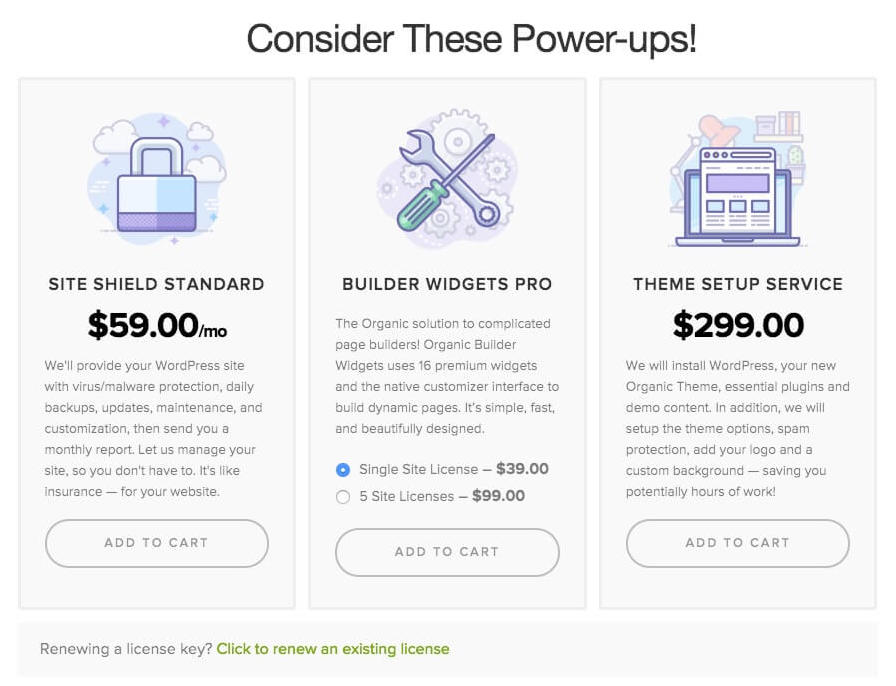
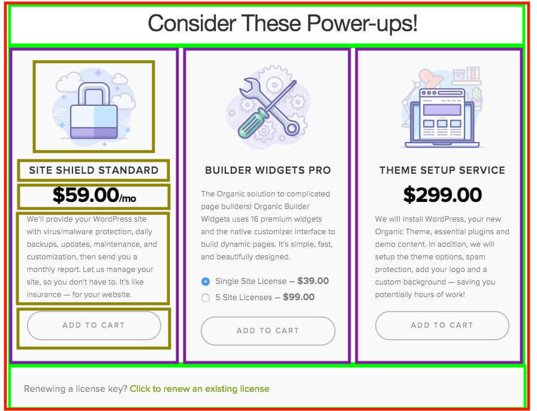

# CSS-Exercise-Recreate-PowerUps

Practice HTML and CSS by recreating real-life websites - Power Ups!

### Learning Objectives

- Loading Google Fonts
- Using form and the input radio element
- Using Flexbox
- Using media queries
- Centering block elements using margin: 0 auto;
- Transitions
- CSS: box-shadow, border-radius, etc.

## Description

Recreate the following Pricing Plans mockup using HTML and CSS:

1) Group Assignment: Work with your team to recreate a pricing plan (choose A, B, C or D from the `Pricing Plan` folders).

2) Individual Assignment: Pick one pricing plan section from the `Individual` folders and try to recreate it on your own. Ask for help, but NOT for code!

> MAKE SURE TO CHECK YOUR CODE THROUGH W3C VALIDATOR AND CHROME'S LIGHTHOUSE AUDITING TOOL (CHECK FOR A11y, SEO, BEST PRACTICES SCORES).

Good luck!

