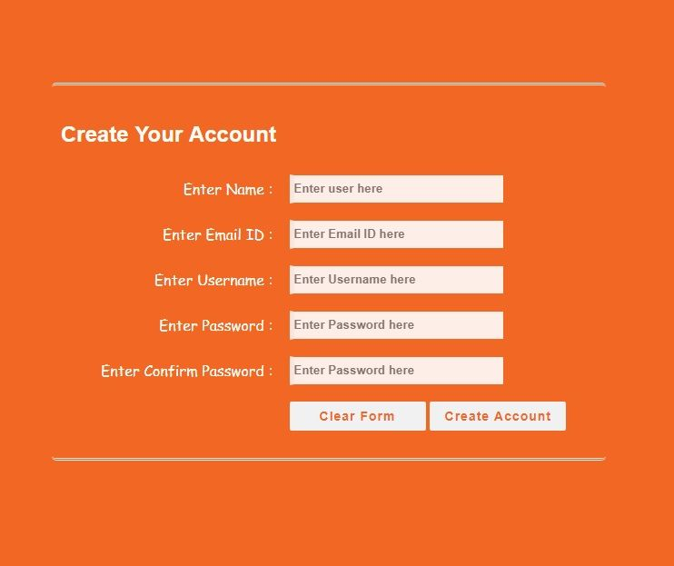

# THE FRONT-END | HTML & CSS BASICS

[**Submission Instructions (Ctrl+Click to open in a new Tab)**](https://github.com/SocialHackersAcademy/FrontEndCourseExercises/#instructions)

#### INSTRUCTIONS

Here are your assignments for this lesson:

**1)** Use [Loom](loom.com) or some other kind of screen recording software to record and upload the following screencast:
  - Record a coding session where you build a basic HTML boilerplate, with just the basic building blocks (doctype, head, body, etc.) and explaining each element's functionality and role, e.g. DOCTYPE is the document declaration, an instruction to the browser to parse this document as an HTML document, etc.
  - The video must **not be more than 5 minutes** in length
  - You should upload the loom URL or a Google Drive shareable link to the video file

**2)** Create a page that utilizes the following HTML elements:
  - a, img, p, h1, h2, h3.
  - You must choose a topic and create a page with links to various subjects related to the topic. Examples: create a web page with a list of Greek islands. A series of photos of Greek islands accompanied by a small description and a link to a relevant page. Another example would be a page with information about popular cryptocurrencies. Choose whatever topic you want.

**3)** Create a table that contains information about the the `world's biggest polluters`. You should get the information from [this site](https://gulfnews.com/photos/news/who-are-the-worlds-biggest-polluters-1.1572250802844?slide=1).
  - The table must include information about each `country`, the `metric tons per year` that it produces and a reference to the [source](http://www.globalcarbonatlas.org/en/CO2-emissions).

**4)** Create a registration form according to this [screenshot](./ASSETS/exercise-html-form-creation.jpg).

**5)** Create a search engine form that sends the request to bing.
  - The search URL you'll use is the following: [https://www.bing.com/search?q=ferrari](https://www.bing.com/search?q=ferrari)
  - The action URL must be modified accordingly along with the input elements and their respective `name` attributes.

At this stage, you should only consider HTML and **not add any styling yet**.

**6)** Create a copy of the previous HTML pages you've created and style them using CSS:
  - You must include the following in your web pages:
    - inline styles
    - internal style tags `style`
    - external styles, `link`
    - use of classes
    - use of multiple classes per element
    - use of IDs
    - use of `text-align` CSS rule
    - use of `color` and `background-color` CSS rules
    - use of `font-family` and `font-size` CSS rules
    - use of `border` CSS rule
    - Apply colors for both the text content and the background color of the elements. You can choose from the list of available color names found [here](https://developer.mozilla.org/en-US/docs/Web/CSS/color_value#Color_keywords)
    - You are free to use any other CSS rule you like!
    - Be creative!

**7)** Accessibility: Use the tools and methodology described in this lesson's videos to make sure that your website is accessible to all. Test your color contrast with one (or both) of the following tools and ensure that they pass all the tests:
  - [https://webaim.org/resources/contrastchecker/](https://webaim.org/resources/contrastchecker/)
  - [https://contrast-ratio.com/](https://contrast-ratio.com/)

**8)** Last, but not least, don't forget to add a star to the GitHub repository of the fantastic Lea Verou and her amazing contrast checker tool: [https://github.com/leaverou/contrast-ratio](https://github.com/leaverou/contrast-ratio).

#### Submission

Don't forget to create a `README.md` file in your repository containing the URL of the screen recording.

You must add your instructor as a Collaborator to the GitHub repository.

[Project Page](https://athena.socialhackersacademy.org/topic/html-css-basics/)

---

_Photo by Miguel Á. Padriñán from Pexels_
